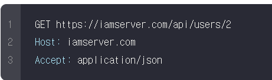

# RESTfulAPI

- RESTfulAPI
    - �봽濡좏?���뿏�뱶���? 諛깆뿏�뱶媛�? �냼�넻�븯�뒗 �뿏�뱶�룷�씤�듃
    - �빋�씠�굹 �쎒 �긽�뿉�꽌 �옉�룞�븯�뒗 �뼱�뵆?��?����?����?? 媛쒕컻�?�� HTTP�굹 HTTPS �봽濡쒗?��?��?��?�� �궗�슜�븯�뿬 API?���? 留뚮뱺�?��.
    - API �젙�쓽媛� �뼹留덈�? 吏곴���쟻�씠??�� 紐낇?���븳吏��뿉 �뵲�씪 �봽濡쒖?���듃�쓽 蹂듭?���룄媛� �겕寃� �궙�븘吏�硫� �떆�뒪��?? �꽕??�꾩�? �엳�뼱�꽌 以묒?���븳 �옄?��?���? 李⑥���븳�떎.
    - �씪?��?��?�� �빟�냽�쓣 �넻�빐 API?���? �젙�쓽�븳�떎.
        - HTTP 硫붿?���뱶���? URI(Uniform Resource Identifiers)�씠�떎.
        - �궗�슜�옄媛� �몴�쁽�쓣 �씫??�� API�뿉寃� 湲곕���븯�뒗 �룞�옉??�� �꽌踰꾨�? �닔�뻾�븯�뒗 �룞�옉�쓣 �씪移섏?��??�쒖�? �븳�떎.
- REST媛� �쓽誘명�?�뒗 寃껋�� ?��?��뾿�?��媛�?
    - **RE**presentational?��**S**tate?��**T**ransfer
    - ����몴�?���씤 �긽�깭 �뇭 �몴�쁽�맂 �긽�깭濡� �빐�꽍�븷 �닔 �엳�떎.
        - ?��?�냼�뒪�쓽 �긽�깭?���? �뼐湲고븳�?��.
    - �넻�떊�쓣 �넻�빐 �옄�썝�쓽 �몴�쁽�맂 �긽�깭?���? 二쇨??�諛?��?�� 寃껋�? �����? �븘�궎��?�泥�? 媛��씠�뱶�씪�씤.
- �넻�떊�쓣 二쇨??? 諛쏅?�� 寃껋�� ?��?�냼�뒪媛� �븘�땲�떎.
    
    
    
    - �겢�씪�씠�뼵�듃媛� �꽌踰꾩뿉寃�? �듅�젙 ��??����?�� �젙蹂�??�� 諛쏆븘�?���뒗 API �뿏�뱶�룷�씤�듃?���? �넻�빐 �슂泥�
    
    
    
    - �렪�쓽�긽 �슦?��?�뒗 �씠 �긽�솴�쓣?��**`/api/users/2`**
    �씪�뒗 �뿏�뱶�룷�씤�듃?���? �넻�빐�꽌 2踰� ��??���? �뜲�씠�꽣 ?��?�냼�뒪?���? 諛쏆븘�?���떎??�� �몴�쁽�븯吏�留�, ��??����?�� ?��?�냼�뒪媛� �븘�땲�떎.
    - �꽌踰꾧�� 蹂�??궡以�? JSON���? �떒吏� �뜲�씠�꽣踰좎?���뒪�뿉 ����?���릺�뼱 �엳�뒗 �썝蹂� �뜲�씠�꽣 ?��?�냼�뒪�쓽 �쁽�옱 �긽�깭?���? �몴�쁽.

- URI
    - API媛� �뼱�뼡 ?��?�냼�뒪�뿉 �����? API�씤吏�?���? �굹����궡�?�� �슂�냼
    - RESTful API�뒗 �씠�윭�븳 ?��?�냼�뒪 媛꾩?�� ??�꾩�? ?��?��?�瑜?���?**`/`**
    ?���? �궗�슜�븯�뿬 �몴�쁽�븷 寃껋?�� 沅뚯?��
    
    
    
    
    
    - �긽�쐞 ??�꾩�? ?��?�냼�뒪?���? �젙�븷 �븣 �뼱�뼡 寃� �뜑 紐낇?���븯�깘�뿉 �뵲�씪 URI?���? �꽕??�꾨�� �븷 �닔 �엳�떎.
    - RESTful API�뒗 URI?���? �궗�슜�븯�뿬 �뻾�쐞?���? �몴�쁽�븯吏� �븡�쓣 寃껋?�� 沅뚭???
    - �삱諛붾?��寃� �옉�꽦�맂 �뿏�뱶�룷�씤�듃�뒗 �궘�젣?���? �쓽誘명�?�뒗 HTTP 硫붿?���뱶�씤?��**`DELETE`**?���? �궗�슜�븳 �슂�윴 �뿏�뱶�룷�씤�듃媛� �맆 寃껋?���떎.
    
    
    
    - API?���? �궗�슜�븯�뿬 �븯寃뚮릺�?�� �뻾�쐞�뒗 ���遺�遺꽷�**`CRUD(Create, Read, Update, Delete)`**?���씠湲� �븣?��몄뿉, 紐� 媛�吏� �듅�닔�븳 寃쎌?��?���? �젣�쇅�븯硫� �떒 5媛�吏��쓽 HTTP 硫붿?���뱶留뚯?��濡쒕�? ���遺�遺꾩쓽 API?���? �젙�쓽�븷 �닔 �엳�떎.
    
    
    
    - **PUT??�� PATCH�쓽 李⑥?��**
        - **`PUT`**
        ?��硫붿?���뱶?���? �궗�슜�븯�뿬 �씠 ?��?�냼�뒪?���? �닔�젙�븳�떎硫� �슦?��?�뒗 諛섎뱶�?�� �슂泥� 諛붾뵒��? ��??���? ?��?�냼�뒪 �쟾泥�??�� �몴�쁽�븯�뿬 蹂�??궡�빞�븳�?��.
        
        
        
        - PUT 硫붿?���뱶�뒗 ?��?�냼�뒪?���? �닔�젙�븯�뒗 寃껋?�� �븘�땲�씪 ���泥?���?�뒗 寃껋?���떎
        - **`PATCH`**
        ?��PATCH 硫붿?���뱶�뒗 ?��?�냼�뒪�쓽 �씪?���遺꾩쓣 �닔�젙�븯�뒗 寃껋?���떎
        
        
        
        - **`PUT`**?��硫붿?���뱶���? �떎?��?��쾶혻**`PATCH`**硫붿?���뱶�뒗 吏꾩쭨濡�? �쁽�옱 ����?���릺�뼱 �엳�뒗 ?��?�냼�뒪�뿉 �닔�젙�쓣 媛��븯�뒗 �뻾�쐞?���? �쓽誘명�?湲� �븣?��몄뿉 ?��?��?�� �닔�젙�븯吏� �븡���? �궗�빆�쓣 �슂泥� 諛붾뵒��? �떞�븘以� �븘�슂�룄 �뾾�떎.
        - 洹몃?���굹?��**`PUT`**?��硫붿?���뱶���혻**`PATCH`** 硫붿?���뱶�쓽 吏꾩�? 以묒?���븳 李⑥?���젏���?
            
            �씠�윴 �뻾�쐞�쓽 �쓽誘멸�� �븘�땲�씪,?��**`PUT`**硫붿?���뱶�뒗 諛섎뱶�?�� 硫깅벑��?�쓣 蹂댁?���븯吏�留뙿�?**`PATCH`**?��硫붿?���뱶�뒗 硫깅벑��?�쓣 蹂댁?���븯吏� �븡�쓣 �닔�룄 �엳�떎�뒗 寃껋?���떎.
            
            - **`硫깅벑��?`**�씠���?, �닔�븰�씠�굹 �쟾�궛�븰�뿉�꽌 �뼱�뼡 ����긽��? 媛숈�� �뿰�궛�쓣 �뿬�윭 踰� �쟻�슜�빐�룄 寃곌?��媛� �떖�씪吏�吏� �븡�뒗 �꽦吏�
            - ����몴�?���쑝濡� 硫깅벑��?�씠 蹂댁?���릺�뒗 �뿰�궛���? 諛붾�? �뼱�뼚�븳 �닔�뿉 1�쓣 ??�깊�?�뒗 �뿰�궛
            - **`x => x * 1`**
            ??�� 媛숈�� �븿�닔�뒗 �뼱�뼚�븳 媛�?�뿉 1踰덉?�� �쟻�슜�븯�뱺, 10,000踰덉?�� �쟻�슜�븯�뱺 �빆�긽?��**`x`**?���? 諛섑?���븳�떎.
        - HTTP 硫붿?���뱶 �삉�븳 寃곌?�� �뼱�뼚�븳 �옄�썝�쓣 �씫??�� �벐??�� �닔�젙�븯??�� 吏��슦�뒗 CRUD�뿉 �����? �쓽誘몃�� 媛�吏�湲� �븣?��몄뿉, �슦?��?�뒗 �뼱�뼡 �뻾�쐞媛� 硫깅벑��?�쓣 蹂댁?���븯??�� �뼱�뼡 �뻾�쐞媛� 硫깅벑��?�쓣 蹂댁?���븯�뒗吏� �븣??�� �엳�뼱�빞 �뼱�뵆?��?����?����?��?�� �삁�긽�븯吏� 紐삵�? 諛⑺�?�쑝濡� �룞�옉�븯�뒗 寃껋?�� 諛⑹��
        
        
        
        - **`POST`**
        ?��硫붿?���뱶�쓽 寃쎌?�� ?��?�냼�뒪?���? �깉濡�寃� �깮�꽦�븯�뒗 �뻾�쐞?���? �쓽誘명�?湲� �븣?��몄뿉 �뿬�윭 踰� �닔�뻾�븯寃� �릺硫� 留ㅻ�? �깉濡쒖?�� ?��?�냼�뒪媛� �깮�꽦
        - **`GET`**�쓣 �뿬�윭 踰� �닔�뻾�뻽�쓣 �븣 諛쒖�?�븯�뒗 �뿉�윭���혻**`POST`**?���? �뿬�윭 踰� �닔�뻾�뻽�쓣 �븣 諛쒖�?�븯�뒗 �뿉�윭�뒗 �쟾���? �떎?���? ??�⑦??��?���듃?���? 媛�吏�??�� �엳�쓣 �닔 �엳�떎�뒗 寃�
        - **`PATCH` ?���? �씠�윴�떇�쑝濡� �궗�슜�븯硫� 硫깅벑��?�씠 蹂댁?�� x**
        
        
        
        ?��?���?:[https://evan-moon.github.io/2020/04/07/about-restful-api/](https://evan-moon.github.io/2020/04/07/about-restful-api/)